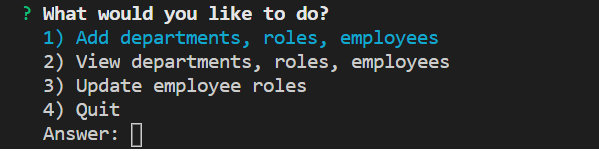

# Employee-Management-Tracker

  ## Description
  A console application that assists users to manage employees. This app allow users to create employees, roles (aka job titles), and departments in which these roles belong to. This app then keeps track of what role each employee has and which department each role is assigned to, allowing the user to have a convenient way to manage their employees.
  
  ## Table of Contents
  [Installation](#installation)
  [Usage](#usage)
  [Contact Creator](#contact-creator)
 
  ### Installation
  Node, Inquirer, mysql
  
  ### Usage
  Download necessary installations and run node.js in console or other form of terminal in order to make the App listen on your local port 3006. You should then be greeted with a main menu of sorts asking you what you want to do:

  

  Keep answering the questions as you please. Keep in mind that you will have to create at least one department before you can create a role, and at least one role before you can create an employee. This is because you need to assign a role to a department and an employee to a role when creating a role or employee respectively.

  The id number for both role and department can be found under option 2 on the main menu. These numbers are needed when assigning either an employee or role during creation.

 ### Contact Creator

  #### GitHub Username
  [See GitHub](https://github.com/maxhanson07)

  #### Email Address
  mthanson2@gmail.com

  #### How to reach me
  Shoot me an email.